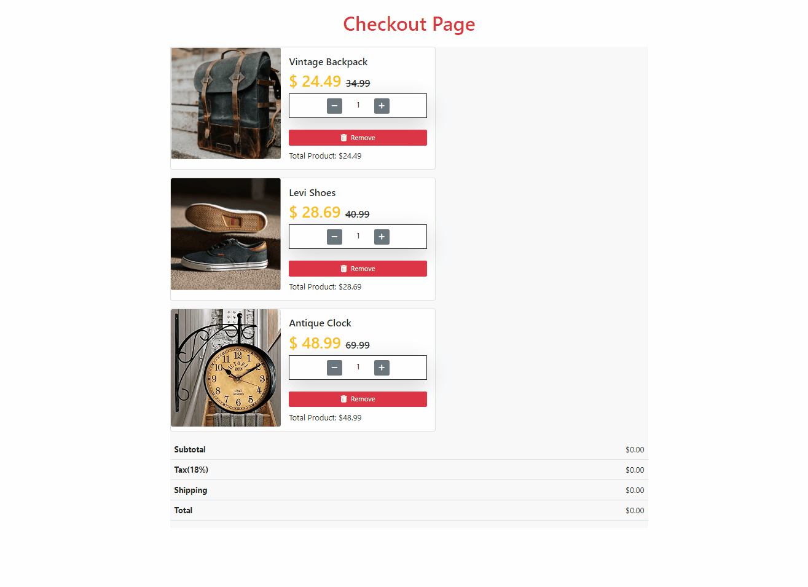

# Checkout Page
<h3>visit: https://aokmen.github.io/Checkout-Page</h3>

---

Description:

## In this project, a checkout page is implemented using HTML, CSS, and JavaScript. Let's break down the functionalities:
---
Initial Setup:

* The project defines constants for the tax rate (vergi) and discount rate (indirim).
* An array named sepettekiler is initialized with three objects representing products in the shopping cart. Each object contains properties such as name, price, quantity, and image URL.
---
Displaying Products:

* The function ekranaBastir() is called to display the products on the page.
* The function iterates over the sepettekiler array using the forEach method.
* For each product, an HTML card element is dynamically created with the product's details and appended to the "ürün-panel" element.
* The card includes the product name, price (with discount and original price displayed), quantity controller buttons, removal button, and total price for the product.
---
Quantity Controller Buttons:

* The function adetButon() is called to handle the quantity controller buttons.
* The function selects all the quantity controller elements using the querySelectorAll method.
* For each quantity controller element, event listeners are added to the plus and minus buttons.
* Clicking the plus button increases the quantity and updates the total price for the product.
* Clicking the minus button decreases the quantity (if greater than zero) and updates the total price for the product.
---
Remove Button:

* The function attaches event listeners to all the remove buttons with the class "remove-ürün".
* When a remove button is clicked, the corresponding card element is removed from the DOM.
* The sepettekiler array is updated by filtering out the removed product using its name.
* Finally, the hesaplaCardTotal() function is called to recalculate and update the total prices.
---
Calculating Total Prices:

* The function hesaplaCardTotal() is responsible for calculating and updating the total prices displayed on the page.
* The function selects all the total price elements for the products.
* The total prices are summed up using the reduce method and assigned to the "Subtotal" field.
* The tax, shipping cost, and total amount are calculated based on the subtotal and displayed accordingly.
* CSS styles and external libraries (Bootstrap and Font Awesome) are used to enhance the visual appearance and responsiveness of the checkout pag
